An Illustrated Description of the Core Algorithm
================================================

This page contains an explanation of the algorithm behind the Python dendrogram
code. This is demonstrated with a step by step example of how the algorithm
constructs the tree structure of a very simple one-dimensional dataset. Even
though this dataset is very simple, what is described applies to datasets with
any number of dimensions.

Basic example
-------------

The following diagram shows a one-dimensional dataset (with flux versus
position) in the solid black line, with the corresponding dendrogram for that
dataset overplotted in green:

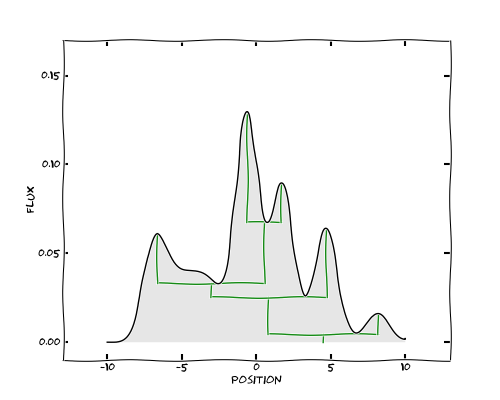

In the rest of this document, we will refer to the individual points in this
dataset as *pixels*.

The way the algorithm works is to construct the tree starting from the
brightest pixels in the dataset, and progressively adding fainter and fainter
pixels. We will illustrate this by showing the current value being considered,
with the following blue dashed line:

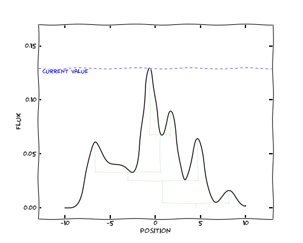

Let's now start moving this line down, starting from the peak pixel in the
dataset. We create our first structure from this pixel. We then move to the
pixel with the next largest value, and each time, we decide whether to join the
pixel to an existing structure, or create a new structure. We only start a new
structure if the value of the pixel is greater than its immediate neighbors,
and therefore is a local maximum. The first structure being constructed is
shown below:

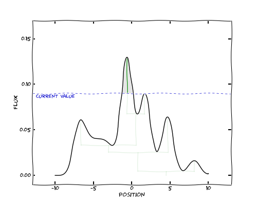

We have now found a local maximum, so rather than add this pixel to the first
structure, we create a new structure. As we move further down, both structures
keep growing, until we reach a pixel that is not a local maximum, and is
adjacent to both existing structures:

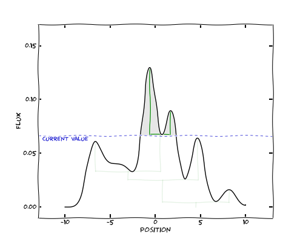

At this point, we merge the structures into a branch, which is shown by a green
horizontal line. As we move down further, the branch continues to grow, and we
very quickly find two more local maxima which cause new structures to be
created:

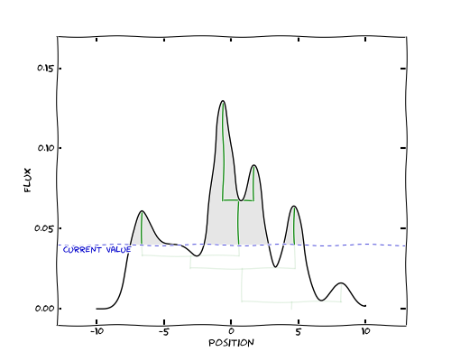

These structures eventually merge, and we end up with a single tree:

Accounting for noise
--------------------

Setting a minimum value (``min_value``)
^^^^^^^^^^^^^^^^^^^^^^^^^^^^^^^^^^^^^^^

Most real-life datasets are likely to contain some level of noise, and below a
certain value of the noise, there is no point in expanding the tree since it
will not be measuring anything physical; new branches will be 'noise spikes'.
By default, the minimum value is set to negative infinity, which means all
pixels are added to the tree. However, you will very likely want to change this
so that only significant features above the noise are included.

Let's go back to the original data. We have left the outline of the complete
tree for reference. We now set a minimum value, which we show below with the
purple line. This is controlled by the ``min_value`` option in
:meth:`~astrodendro.dendrogram.Dendrogram.compute`.

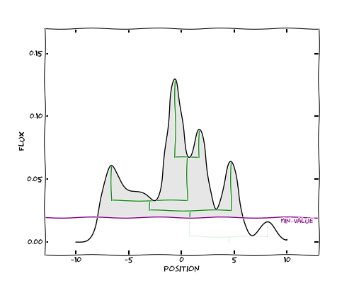
   
The effect on the tree is simply to get rid of (or *prune*) any structure
peaking below this minimum. In this case, the peak on the right is no longer
part of the tree since it is below the minimum specified value.

Setting a minimum significance for structures (``min_delta``)
^^^^^^^^^^^^^^^^^^^^^^^^^^^^^^^^^^^^^^^^^^^^^^^^^^^^^^^^^^^^^

If our data are noisy, we also want to avoid including *local* maxima that - while
above the minimum absolute value specified above - are only identified because of noise,
so we can also define a minimum height required for a structure to be retained.
This is the ``min_delta`` parameter in
:meth:`~astrodendro.dendrogram.Dendrogram.compute`. We show the value
corresponding to the current value being considered plus this minimum height:

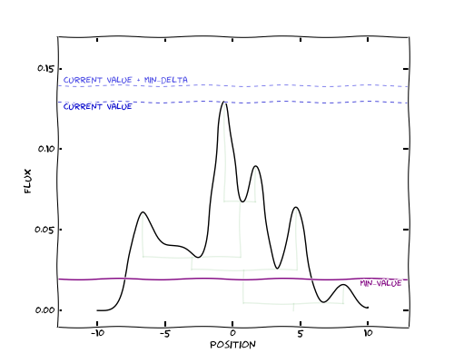

In this case, ``min_delta`` is set to 0.01. As we now move down in flux as
before, the structure first appears red. This indicates that the structure is
not yet part of the tree:

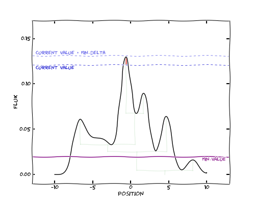

Once the height of the structure exceeds the minimum specified, the structure
can now be considered part of the tree:

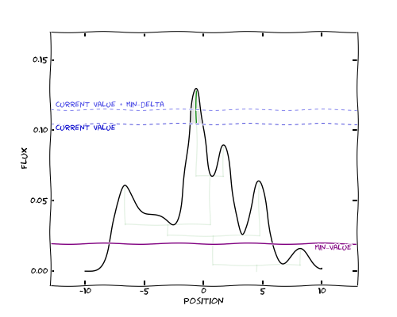

In this case, all structures that are above the minimum value are also all
large enough to be significant, so the tree is the same as before:

We can now repeat this experiment, but this time, with a larger minimum height
for structures to be retained (``min_delta=0.025``). Once we reach the point
where the second peak would have been merged, we can see that it is not high
enough above the merging point to be considered an independent structure:

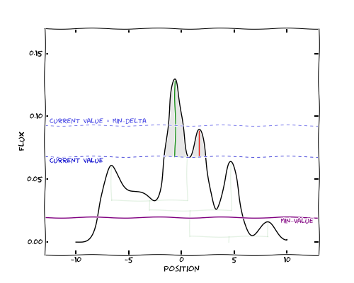

and the pixels are then simply added to the first structure, rather than
creating a branch:

.. image:: algorithm/large_delta_step2.png
   :align: center

We can now see that the final tree looks a little different to the original
one, because the second largest peak was deemed insignificant:

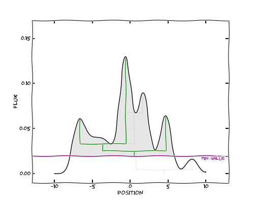

Additional options
------------------

In addition to the minimum height of a structure, it is also possible to
specify the minimum number of pixels that a structure should contain in order
to remain an independent structure (``min_npix``), and in the future, it will
be possible to specify arbitrary criteria, such as the proximity to a given
point or set of coordinates.
