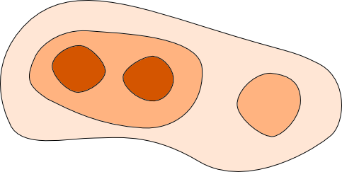
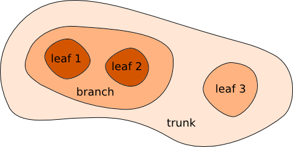

Astronomical Dendrograms in Python
==================================

The ``astrodendro`` package provides an easy way to compute dendrograms of
observed or simulated Astronomical data in Python.

About dendrograms
-----------------

The easiest way to think of a dendrogram is to think of a tree that represents
the hierarchy of the structures in your data. If you consider a
two-dimensional map of a hierarchical structure that looks like:

the equivalent dendrogram/tree representation would look like:

.. image:: schematic_tree.png
   :width: 400px
   :align: center

A dendrogram is composed of two types of structures: *branches*, which are
structures which split into multiple sub-structures, and *leaves*, which are
structures that have no sub-structure. Branches can split up into branches and
leaves, which allows hierarchical structures to be adequately represented. The
term *trunk* is used to refer to a structure that has no parent structure.

Mapping these terms back onto the structure gives the following:

For an example of use of dendrograms on real data, see `Goodman, A. et al
(2009) <http://adsabs.harvard.edu/abs/2009Natur.457...63G>`_.

Documentation
-------------

.. toctree::
   :maxdepth: 2

   installing.rst
   algorithm.rst
   using.rst
   plotting.rst
   catalog.rst
   advanced.rst
   migration.rst

Reporting issues and getting help
---------------------------------

Please help us improve this package by reporting issues via `GitHub
<https://github.com/dendrograms/astrodendro/issues>`_. You can also open an
issue if you need help with using the package.

Developers
----------

This package was developed by:

* Thomas Robitaille
* Chris Beaumont
* Adam Ginsburg
* Braden MacDonald
* Erik Rosolowsky

Acknowledgments
---------------

Thanks to the following users for using early versions of this package and
providing valuable feedback:

* Katharine Johnston

Citing astrodendro
------------------

If you make use of this package in a publication, please consider adding the
following acknowledgment:

*This research made use of astrodendro, a Python package to compute dendrograms
of Astronomical data (http://www.dendrograms.org/)*

If you make use of the analysis code (:doc:`catalog`) or read/write FITS files,
please also consider adding an acknowledgment for Astropy (see
`<http://www.astropy.org>`_ for the latest recommended citation).

Public API
----------

.. toctree::
   :maxdepth: 1

   api/astrodendro.dendrogram.Dendrogram
   api/astrodendro.dendrogram.periodic_neighbours
   api/astrodendro.structure.Structure
   api/astrodendro.plot.DendrogramPlotter
   api/astrodendro.analysis
   api/astrodendro.pruning
