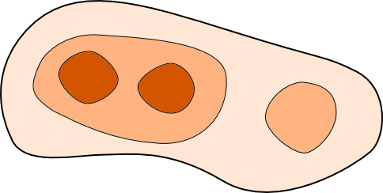
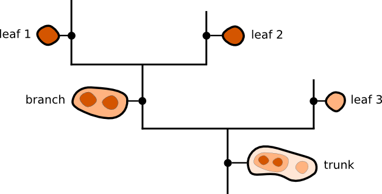
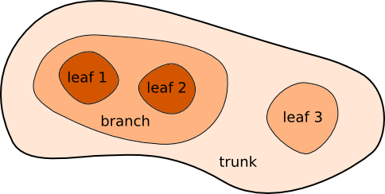

Astronomical Dendrograms in Python
==================================

The ``astrodendro`` package provides an easy way to compute dendrograms of
observed or simulated Astronomical data in Python. This package is still under
development, although a first release will be available in the near future.
You can already try out the existing package, but we recommend that you get in
contect with the developers to be kept up-to-date with changes and bug fixes.

About dendrograms
-----------------

The easiest way to think of a dendrogram is to think of a tree that represents
the hierarchy of the structures in your data. If you consider a
two-dimensional map of a hierarchical structure that looks like:

   
the equivalent dendrogram/tree representation would look like:

A dendrogram is composed of two types of structures: *branches*, which are
structures which split into multiple sub-structures, and *leaves*, which are
structures that have no sub-structure. Branches can split up into branches and
leaves, which allows hierarchical structures to be adequately represented. The
term *trunk* is used to refer to a structure that has no parent structure.

Mapping these terms back onto the structure gives the following:

For an example of use of dendrograms on real data, see `Goodman, A. et al
(2009) <http://adsabs.harvard.edu/abs/2009Natur.457...63G>`_.

Documentation
-------------

.. toctree::
   :maxdepth: 2

   installing.rst
   algorithm.rst
   using.rst
   plotting.rst
   catalog.rst
   migration.rst

Reporting issues
----------------

Please help us improve this package by reporting issues via `GitHub
<https://github.com/dendrograms/dendro-core/issues>`_.

Developers
----------

This package was developed by:

* Thomas Robitaille
* Chris Beaumont
* Braden MacDonald
* Erik Rosolowsky

Acknowledgments
---------------

Thanks to the following users for using early versions of this package and
providing valuable feedback:

* Katharine Johnston

Public API
----------

.. toctree::
   :maxdepth: 1

   api/astrodendro.dendrogram.Dendrogram
   api/astrodendro.structure.Structure
   api/astrodendro.plot.DendrogramPlotter
   api/astrodendro.analysis
