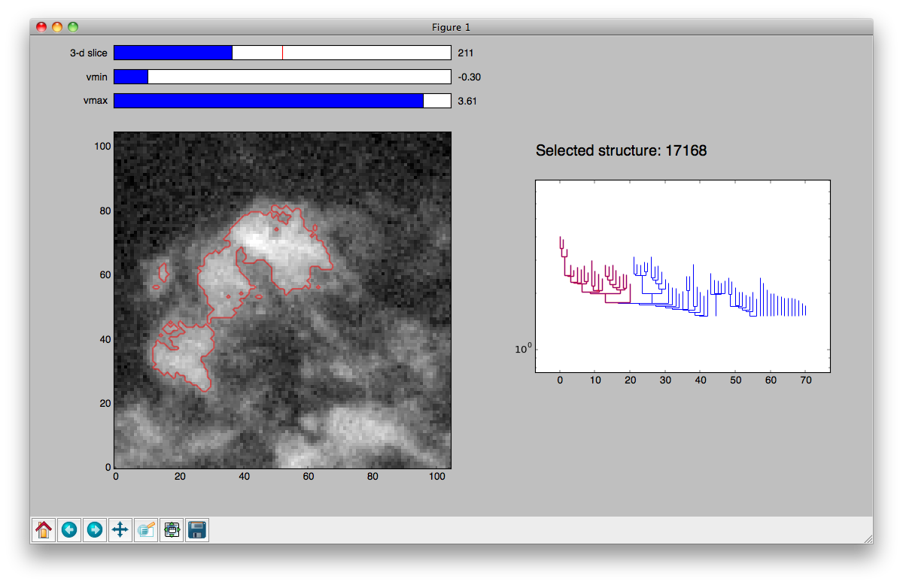
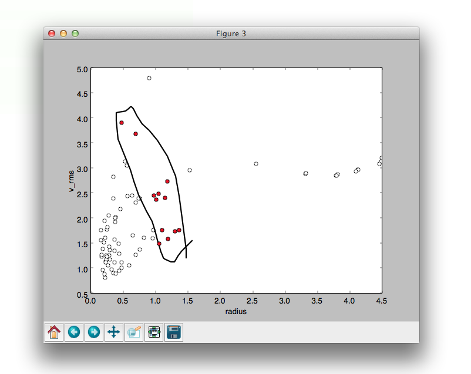
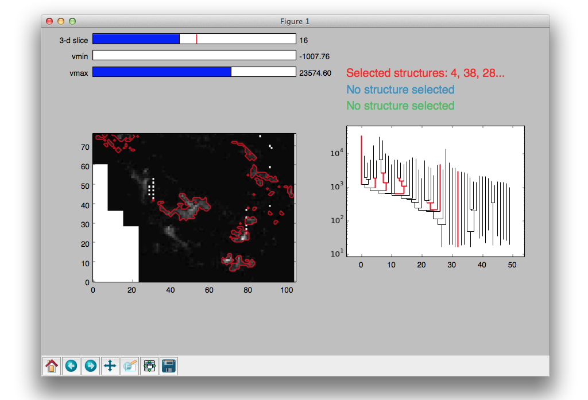

Plotting Dendrograms
====================

Once you have computed a dendrogram, you will likely want to plot it as well as
over-plot the structures on your original image.

Interactive Visualization
-------------------------

One you have computed your dendrogram, the easiest way to view it interactively
is to use the :meth:`~astrodendro.dendrogram.Dendrogram.viewer` method::

    d = Dendrogram.compute(...)
    v = d.viewer()
    v.show()

This will launch an interactive window showing the original data, and the
dendrogram itself. Note that the viewer is only available for 2 or 3-d
datasets. The main window will look like this:

Within the viewer, you can:

**Highlight structures:** either click on structures in the dendrogram to
highlight them, which will also show them in the image view on the left, or
click on pixels in the image and have the corresponding structure be
highlighted in the dendrogram plot. Clicking on a branch in the dendrogram plot
or in the image will highlight that branch and all sub-structures.

Multiple structures can be highlighted in different colors using the three
mouse buttons: Mouse button 1 (Left-click or "regular" click), button 2
(Middle-click or "alt+click"), and button 3 (Right-click/"ctrl+click").
Each selection is independent of the other two; any of the three can be
selected either by clicking on the image or the dendrogram.

**Change the image stretch:** use the ``vmin`` and ``vmax`` sliders above the
image to change the lower and upper level of the image stretch.

**Change slice in a 3-d cube:** if you select a structure in the dendrogram for
a 3-d cube, the cube will automatically change to the slice containing the peak
pixel of the structure (including sub-structures). However, you can also change
slice manually by using the ``slice`` slider.

**View the selected structure ID:** in a computed dendrogram, every structure
has a unique integer ID (the ``.idx`` attribute) that can be used to recognize
the identify the structure when computing catalogs or making plots manually
(see below).

**Linked scatter plots:**
If you have built a catalog (see :doc:`catalog`), you can also
display a scatterplot of two catalog columns, linked to the viewer. Selections
in the main viewer update the colors of the points in this plot::

    from astrodendro.scatter import Scatter
    ... code to create a dendrogram (d) and catalog ...
    dv = d.viewer()
    ds = Scatter(d, dv.hub, catalog, 'radius', 'v_rms')
    dv.show()

The catalog properties of dendrogram structures will be plotted here. You can 
select structures directly from the scatter plot by clicking and dragging a 
lasso, and the selected structures will be highlighted in other plots:

Making plots for publications
-----------------------------

While the viewer is useful for exploring the dendrogram, it does not allow one
to produce publication-quality plots. For this, you can use the non-interactive
plotting interface. To do this, you can first use the
:meth:`~astrodendro.dendrogram.Dendrogram.plotter` method to provide a plotting
tool::

    d = Dendrogram.compute(...)
    p = d.plotter()

and then use this to make the plot you need. The following complete example
shows how to make a plot of the dendrogram of the extinction map of the Perseus
region (introduced in :doc:`using`) using
:meth:`~astrodendro.plot.DendrogramPlotter.plot_tree`, highlighting two of the
main branches:

.. plot::
   :include-source:

    import matplotlib.pyplot as plt
    from astropy.io import fits
    from astrodendro import Dendrogram

    image = fits.getdata('PerA_Extn2MASS_F_Gal.fits')
    d = Dendrogram.compute(image, min_value=2.0, min_delta=1., min_npix=10)
    p = d.plotter()

    fig = plt.figure()
    ax = fig.add_subplot(1, 1, 1)

    # Plot the whole tree
    p.plot_tree(ax, color='black')

    # Highlight two branches
    p.plot_tree(ax, structure=8, color='red', lw=2, alpha=0.5)
    p.plot_tree(ax, structure=24, color='orange', lw=2, alpha=0.5)

    # Add axis labels
    ax.set_xlabel("Structure")
    ax.set_ylabel("Flux")

You can find out the structure ID you need either from the interactive viewer
presented above, or programmatically by accessing the ``idx`` attribute of a
Structure.

A :meth:`~astrodendro.plot.DendrogramPlotter.plot_contour` method is also
provided to outline the contours of structures. Calling
:meth:`~astrodendro.plot.DendrogramPlotter.plot_contour` without any arguments
results in a contour corresponding to the value of ``min_value`` used being
shown.

.. plot::
   :include-source:

    import matplotlib.pyplot as plt
    from astropy.io import fits
    from astrodendro import Dendrogram

    image = fits.getdata('PerA_Extn2MASS_F_Gal.fits')
    d = Dendrogram.compute(image, min_value=2.0, min_delta=1., min_npix=10)
    p = d.plotter()

    fig = plt.figure()
    ax = fig.add_subplot(1, 1, 1)
    ax.imshow(image, origin='lower', interpolation='nearest', cmap=plt.cm.Blues, vmax=4.0)

    # Show contour for ``min_value``
    p.plot_contour(ax, color='black')

    # Highlight two branches
    p.plot_contour(ax, structure=8, lw=3, colors='red')
    p.plot_contour(ax, structure=24, lw=3, colors='orange')

Plotting contours of structures in third-party packages
-------------------------------------------------------

In some cases you may want to plot the contours in third party packages such as
`APLpy <http://aplpy.github.com>`_ or `DS9
<http://hea-www.harvard.edu/RD/ds9/site/Home.html>`_. For these cases, the best
approach is to output FITS files with a mask of the structures to plot (one
mask file per contour color you want to show).

Let's first take the plot above and make a contour plot in APLpy outlining all the leaves. We can use the :meth:`~astrodendro.structure.Structure.get_mask` method to retrieve the footprint of a given structure:

.. plot::
   :include-source:

    import aplpy
    import numpy as np
    import matplotlib.pyplot as plt
    from astropy.io import fits
    from astrodendro import Dendrogram

    hdu = fits.open('PerA_Extn2MASS_F_Gal.fits')[0]
    d = Dendrogram.compute(hdu.data, min_value=2.0, min_delta=1., min_npix=10)

    # Create empty mask. For each leaf we do an 'or' operation with the mask so
    # that any pixel corresponding to a leaf is set to True.
    mask = np.zeros(hdu.data.shape, dtype=bool)
    for leaf in d.leaves:
        mask = mask | leaf.get_mask()

    # Now we create a FITS HDU object to contain this, with the correct header
    mask_hdu = fits.PrimaryHDU(mask.astype('short'), hdu.header)

    # We then use APLpy to make the final plot
    fig = aplpy.FITSFigure(hdu, figsize=(8, 6))
    fig.show_colorscale(cmap='Blues', vmax=4.0)
    fig.show_contour(mask_hdu, colors='red', linewidths=0.5)
    fig.tick_labels.set_xformat('dd')
    fig.tick_labels.set_yformat('dd')

Now let's take the example from `Making plots for publications`_ and try and
reproduce the same plot. As described there, one way to find interesting
structures in the dendrogram is to use the `Interactive Visualization`_ tool.
This tool will give the ID of a structure as an integer (``idx``).

Because we are starting from this ID rather than a
:class:`~astrodendro.structure.Structure` object, we need to first get the
structure, which can be done with::

    structure = d[idx]

where ``d`` is a :class:`~astrodendro.dendrogram.Dendrogram` instance. We also
want to create a different mask for each contour so as to have complete control
over the colors:

.. plot::
   :include-source:

    import aplpy
    from astropy.io import fits
    from astrodendro import Dendrogram

    hdu = fits.open('PerA_Extn2MASS_F_Gal.fits')[0]
    d = Dendrogram.compute(hdu.data, min_value=2.0, min_delta=1., min_npix=10)

    # Find the structures
    structure_08 = d[8]
    structure_24 = d[24]

    # Extract the masks
    mask_08 = structure_08.get_mask()
    mask_24 = structure_24.get_mask()

    # Create FITS HDU objects to contain the masks
    mask_hdu_08 = fits.PrimaryHDU(mask_08.astype('short'), hdu.header)
    mask_hdu_24 = fits.PrimaryHDU(mask_24.astype('short'), hdu.header)

    # Use APLpy to make the final plot
    fig = aplpy.FITSFigure(hdu, figsize=(8, 6))
    fig.show_colorscale(cmap='Blues', vmax=4.0)
    fig.show_contour(hdu, levels=[2.0], colors='black', linewidths=0.5)
    fig.show_contour(mask_hdu_08, colors='red', linewidths=0.5)
    fig.show_contour(mask_hdu_24, colors='orange', linewidths=0.5)
    fig.tick_labels.set_xformat('dd')
    fig.tick_labels.set_yformat('dd')
